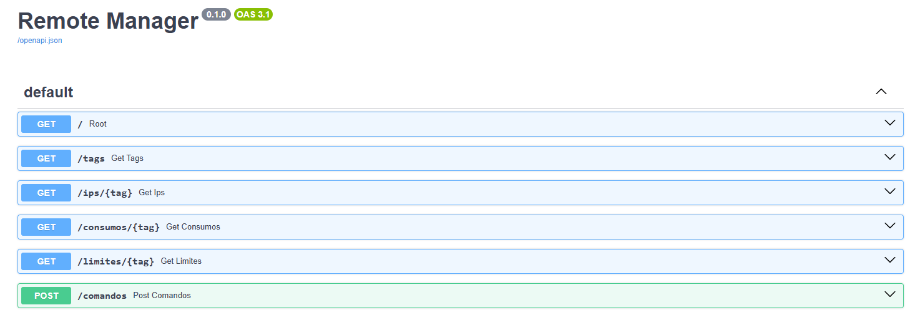

# Gestor Remoto de Cabeceras

## 📚 Índice

- [Descripción](#descripción)
- [🚀 Características principales](#características-principales)
- [🧱 Requisitos](#requisitos)
  - [Instalación local](#instalación-local)
- [📁 Estructura del proyecto](#estrucura-del-proyecto)
- [🧪 Testing](#testing)

## Descripción
**remote_manager** es una aplicación desarrollada en **Python** que permite la gestión remota de cabeceras. 
La aplicación facilita la actualización simultánea del software en múltiples cabeceras, el envío de comandos y la obtención de información desde la API de **Onomondo**.

## Características principales
- **Actualización remota**: Permite actualizar el software de todas las cabeceras sin necesidad de acceder a cada una individualmente.
- **Envío de comandos**: Permite ejecutar comandos de **Bash** en varias cabeceras simultaneamente.
- **Integración con Onomondo**: Obtiene información en tiempo real desde la API de Onomondo para mejorar la gestión y monitoreo de las cabeceras.

## Requisitos
- **Python 3.8+**
- **Librerías:**
   - `paramiko`
   - `cryptography`
   - `requests`
   - `tkinter` (viene por defecto en la mayoría de instalaciones de Python)
   - `tqdm`
   Dependencias necesarias (ver `requirements.txt`)

### Instalación local
Para poder trabajar sin problemas se deberá crear un entorno virtual con las dependencias necesarias de la siguiente manera:
1. Clona este repositorio:
   ```bash
   git clone remote_manager
   cd remote_manager
   ```
2. Crea un entorno virtual (opcional pero recomendado):
   ```bash
   python -m venv venv
   source venv/bin/activate  # En Windows: venv\Scripts\activate
   ```
3. Instala las dependencias:
   ```bash
   pip install -r requirements.txt
   ```

## Estrucura del proyecto
La estrucrura de los scripts del proyecto, es la siguiente
```
📁 ssh/
├── comandos_ssh.py        # Funciones SSH: conexión, envío de comandos, subida de archivos
├── update_devices.py      # Lógica para actualizar dispositivos CA/LX e IMX
├── updateHE.php            # Script remoto que se ejecuta en los dispositivos
├── utils.py               # Herramientas comunes: logging, checksum, autenticación SSH
├── api_petitions.py       # Funciones para obtener datos desde la API de Onomondo
📁 gui/
├── gui_main.py            # Pantalla principal de la interfaz
├── gui_api.py             # Pantalla para ver datos de consumo
├── gui_update.py          # Pantalla para actualizar dispositivos
├── gui_upload.py          # Pantalla para subir archivos o ficheros a los dispositivos
├── gui_commands.py        # Pantalla emergente para selección de IPs o tags
📁 app/
├── main.py                # Implementacion de llamadas API con FastAPI
📁 test/
├── test_main_api.py       # Test con testclient de FastAPI a las llamadas de API
📁 api_onomondo/
└── onomondo.py            # Llamadas API a la Onomondo
```
## Testing
Se ha implementado un sistema de tests para validar las funciones que acceden a la API de Onomondo. Para ello se ha utilizado `pytest` y el cliente de pruebas `TestClient`.

Se ha seguido la siguiente estructura:
``` sh
# Usamos el decorador @patch para simular (mockear) funciones concretas.
@patch("app.main.onomondo.get_tags")  # Simula la función get_tags() que obtiene los tags desde la API
@patch("app.main.utils.api_headers")  # Simula la función api_headers() que crea los headers de autenticación
# La función de test recibe los mocks como argumentos (en orden inverso)
def test_get_tags(mock_headers, mock_tags):
    # Simulamos que api_headers() devuelve un diccionario de autorización falso
    mock_headers.return_value = {'authorization': "fake"}
    # Simulamos que get_tags() devuelve una lista de tags estática
    mock_tags.return_value = ["tag1", "tag2"]

    # Usamos un cliente de pruebas (TestClient) para hacer una petición HTTP GET a la ruta "/tags"
    response = client.get("/tags")

    # Verificamos que la respuesta tenga codigo 200
    assert response.status_code == 200
    # Verificamos que el JSON devuelto sea el esperado
    assert response.json() == {"tags": ["tag1", "tag2"]}
```   
- Este test no accede realmente a la red, porque todo está simulado con `mock`.
- `@patch` reemplaza funciones reales por versiones controladas (falsas), lo que:
 - Aísla el test del entorno externo (API, red, claves).
 - Permite probar sólo la lógica interna de nuestra aplicación.
- `client.get("/tags")` simula un cliente llamando a tu API como si fuera un navegador o Postman.
- Es un test de unidad de un endpoint: verifica que `/tags` responde como debe.

## Servidor web
Para el servicio web se ga usado Uvicorn que es un servidor web rápido y asíncrono para aplicaciones Python, 
especialmente diseñado para ser usado con frameworks como FastAPI. Actúa como un puente entre tu aplicación 
web y las conexiones de red, permitiendo que tu código Python se ejecute de manera eficiente.   

Se ejecuta de la siguiente manera
```sh
uvicorn app.main:app --reload
```  
<p align="center">
    
</p>  

Se accede a la interfaz web por la IP que se nos indica:
```sh
http://127.0.0.1:8000/docs 
```  
<p align="center">
    
</p> 