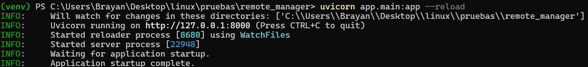
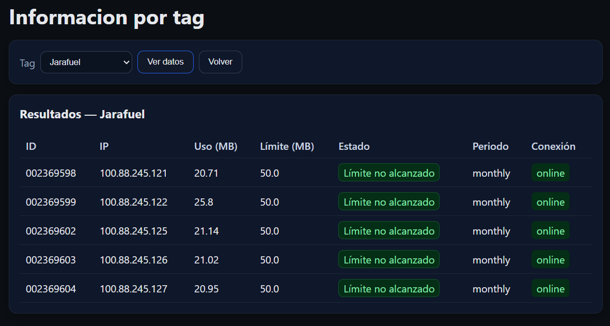
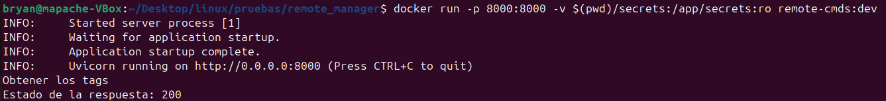
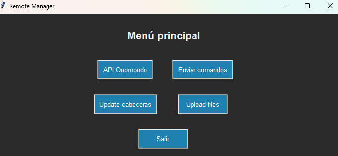
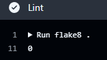
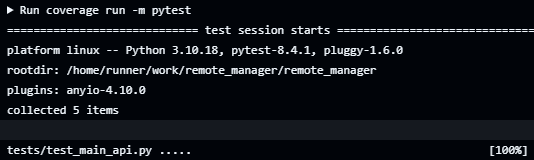
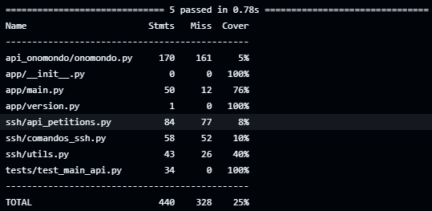
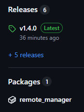

# Gestor Remoto de Cabeceras

## 📚 Índice

- [Descripción](#descripción)
- [🚀 Características principales](#características-principales)
- [🧱 Requisitos](#requisitos)
  - [Instalación local](#instalación-local)
- [📁 Estructura del proyecto](#estrucura-del-proyecto)
- [🧪 Testing](#testing)
- [Servidor web](#servidor-web)
- [Interfaz de escritorio](#interfaz-de-escritorio)
- [Integración continua](#continuous-integration)
- [Seguridad](#seguridad)

## Descripción
**remote_manager** es una aplicación desarrollada en **Python** que permite la gestión remota de cabeceras. 
La aplicación facilita la actualización simultánea del software en múltiples cabeceras, el envío de comandos y la obtención de información desde la API de **Onomondo**.

## Características principales
- **Actualización remota**: Permite actualizar el software de todas las cabeceras sin necesidad de acceder a cada una individualmente.
- **Envío de comandos**: Permite ejecutar comandos de **Bash** en varias cabeceras simultaneamente.
- **Integración con Onomondo**: Obtiene información en tiempo real desde la API de Onomondo para mejorar la gestión y monitoreo de las cabeceras.

## Requisitos
- **Python 3.8+**
- **Librerías:**
   - `paramiko`
   - `cryptography`
   - `requests`
   - `tkinter` (viene por defecto en la mayoría de instalaciones de Python)
   - `tqdm`
   Dependencias necesarias (ver `requirements.txt`)

### Instalación local
Para poder trabajar sin problemas se deberá crear un entorno virtual con las dependencias necesarias de la siguiente manera:
1. Clona este repositorio:
   ```bash
   git clone remote_manager
   cd remote_manager
   ```
2. Crea un entorno virtual (opcional pero recomendado):
   ```bash
   python -m venv venv
   source venv/bin/activate  # En Windows: venv\Scripts\activate
   ```
3. Instala las dependencias:
   ```bash
   pip install -r requirements.txt
   ```

## Estrucura del proyecto
La estrucrura de los scripts del proyecto, es la siguiente
```
📁 ssh/
├── comandos_ssh.py        # Funciones SSH: conexión, envío de comandos, subida de archivos
├── update_devices.py      # Lógica para actualizar dispositivos CA/LX e IMX
├── updateHE.php            # Script remoto que se ejecuta en los dispositivos
├── utils.py               # Herramientas comunes: logging, checksum, autenticación SSH
├── api_petitions.py       # Funciones para obtener datos desde la API de Onomondo
📁 gui/
├── gui_main.py            # Pantalla principal de la interfaz
├── gui_api.py             # Pantalla para ver datos de consumo
├── gui_update.py          # Pantalla para actualizar dispositivos
├── gui_upload.py          # Pantalla para subir archivos o ficheros a los dispositivos
├── gui_commands.py        # Pantalla emergente para selección de IPs o tags
📁 app/
├── 📁 templetes/
|   ├── base.html               # Layout + estilos oscuros + HTMX (CDN)
|   ├── _router_info_tag.html   # Vista principal de la informacion por tag
|   ├── router_info_tag.html    # Parcial HTMX (tabla de resultados)
├── 📁 webui/
|   ├── router_info_tag.html    # Pantalla “Consumos por tag” (fusiona consumos + IPs + limites)
├── main.py                # Implementacion de llamadas API con FastAPI
├── version.py             # Guarda la version proveniente del semantic_release (pipeline)
📁 test/
├── test_main_api.py       # Test con testclient de FastAPI a las llamadas de API
📁 api_onomondo/
└── onomondo.py            # Llamadas API a la Onomondo
```
## Testing
Se ha implementado un sistema de tests para validar las funciones que acceden a la API de Onomondo. Para ello se ha utilizado `pytest` y el cliente de pruebas `TestClient`.

Se ha seguido la siguiente estructura:
``` sh
# Usamos el decorador @patch para simular (mockear) funciones concretas.
@patch("app.main.onomondo.get_tags")  # Simula la función get_tags() que obtiene los tags desde la API
@patch("app.main.utils.api_headers")  # Simula la función api_headers() que crea los headers de autenticación
# La función de test recibe los mocks como argumentos (en orden inverso)
def test_get_tags(mock_headers, mock_tags):
    # Simulamos que api_headers() devuelve un diccionario de autorización falso
    mock_headers.return_value = {'authorization': "fake"}
    # Simulamos que get_tags() devuelve una lista de tags estática
    mock_tags.return_value = ["tag1", "tag2"]

    # Usamos un cliente de pruebas (TestClient) para hacer una petición HTTP GET a la ruta "/tags"
    response = client.get("/tags")

    # Verificamos que la respuesta tenga codigo 200
    assert response.status_code == 200
    # Verificamos que el JSON devuelto sea el esperado
    assert response.json() == {"tags": ["tag1", "tag2"]}
```   
- Este test no accede realmente a la red, porque todo está simulado con `mock`.
- `@patch` reemplaza funciones reales por versiones controladas (falsas), lo que:
 - Aísla el test del entorno externo (API, red, claves).
 - Permite probar sólo la lógica interna de nuestra aplicación.
- `client.get("/tags")` simula un cliente llamando a tu API como si fuera un navegador o Postman.
- Es un test de unidad de un endpoint: verifica que `/tags` responde como debe.

## Servidor web
Para el servicio web se ha usado Uvicorn que es un servidor web rápido y asíncrono para aplicaciones Python, 
especialmente diseñado para ser usado con frameworks como FastAPI. Actúa como un puente entre tu aplicación 
web y las conexiones de red, permitiendo que tu código Python se ejecute de manera eficiente.   

Se ejecuta de la siguiente manera:
```sh
uvicorn app.main:app --reload
```  
<p align="center">
    
</p>  

Se accede a la interfaz web por la IP que se nos indica:
```sh
http://localhost:8000/docs 
```  
<p align="center">
    
</p>

### UI web (FastAPI + Jinja2 + HTMX)
Esta UI añade pantallas web que consultan por HTTP interno los endpoints existentes y pintan una tabla con la 
información de cada SIM por tag: ID, IP, uso (MB), límite de datos (MB), período, estado de conexión.
Para acceder a la interfáz se hara de la siguiente manera:
```sh
http://localhost:8000/ui/info_tag
```
<p align="center">
    
</p>  


## Imagen Docker
Se ha creado el `Dockerfile` para crear la imagen Docker. Para realizar la pruebas se puede montar la imagen en local lanzando los siguientes comandos:
- Construir la imagen:
```sh
docker build -t remote-cmds:dev .
```  
- Correr la imagen:
```sh
docker run \
  -p 8000:8000 \
  -v $(pwd)/secrets:/app/secrets:ro \
  -e IDEM_ADMIN="gAAAAABk...." \
  remote-cmds:dev
```
- `-v $(pwd)/secrets:/app/secrets:ro`: es una opción de `docker run` para montar un volumen (es decir, enlazar un directorio de la máquina al contenedor).  
   * `-v <origen>:<destino>:<modo>`
   * `-v` → “volume”, montar algo en el contenedor.
   * `$(pwd)/secrets` → ruta en la máquina host.
     * `$(pwd)` significa “current working directory” (directorio actual).
     * Así se coloca en la raíz de tu proyecto, $(pwd)/secrets apunta a la carpeta secrets/ donde se tiene `apisecret_admin.key`.
   * `/app/secrets` → Esa carpeta se monta dentro del contenedor
   * `ro` → De forma opcional, se puede hacerl solo lectura (`ro`) o lectura/escritura (`rw`).

Si estuviera en otra ruta se usaría, por ejemplo `~/Documentos/miclave/`:
  ```sh
  -v /home/usuario/Documentos/miclave:/app/secrets:ro
  ```

<p align="center">
    
</p>

## Interfaz de escritorio
Se ha desarrollado una interfaz de escritorio para acceder a las herramientas sin necesidad de levantar los servicios web.
Para acceder a esta interfaz se ejecuta:
```sh
python .\main_gui.py
```
<p align="left">
    
</p>

## Continuous Integration
Se han creado pipelines en Github Actions para automátizar procesos, para ello se han creado distintos workflows en los que se lanza los distintos procesos.
1. Test
En este worflow `test.yml` ejecuta:
- Linter (`flake8`)
<p align="left">
    
</p>  

- test (`pytest` + `coverage`)
<p align="left">
    
</p>  
<p align="left">
    
</p>  

Así se valida el código automáticamente en cada cambio que se haga.  

2. Semantic Release  
El el workflow `release-build.yml` que solo se realiza en la rama `main`
- Analiza los commits
- Genera una versión (v1.0.0, v1.1.0, etc.)
- Actualiza CHANGELOG.md, package-lock.json
- Hace push al repo con los cambios generados
<p align="left">
    
</p>  

## Seguridad
- El acceso a la API se realiza mediante un token encriptado. Para ello se hace uso del script `encript_pass.py`
```bash
from cryptography.fernet import Fernet

# Generar una clave y guardarla para su uso posterior
key = Fernet.generate_key()

# Guardar la clave en un archivo seguro (esto es importante para poder desencriptar después)
with open("apisecret.key", "wb") as key_file:
    key_file.write(key)

# Crear el objeto Fernet con la clave generada
cipher_suite = Fernet(key)

# La API key que deseas encriptar
api_key = b"API key"
# Encriptar la API key
cipher_text = cipher_suite.encrypt(api_key)
print(f"API key encriptada: {cipher_text}")
```
- Las conexiones SSH requieren usuario, contraseña y se realizan con aceptación automática de claves.